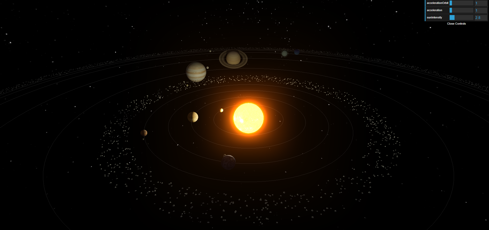
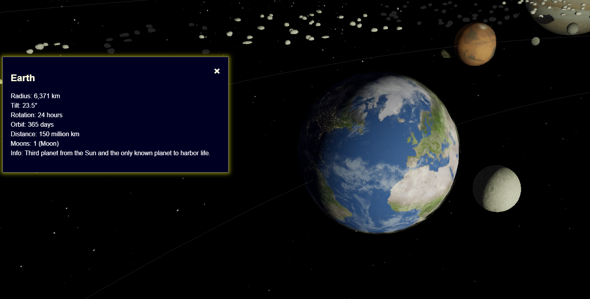
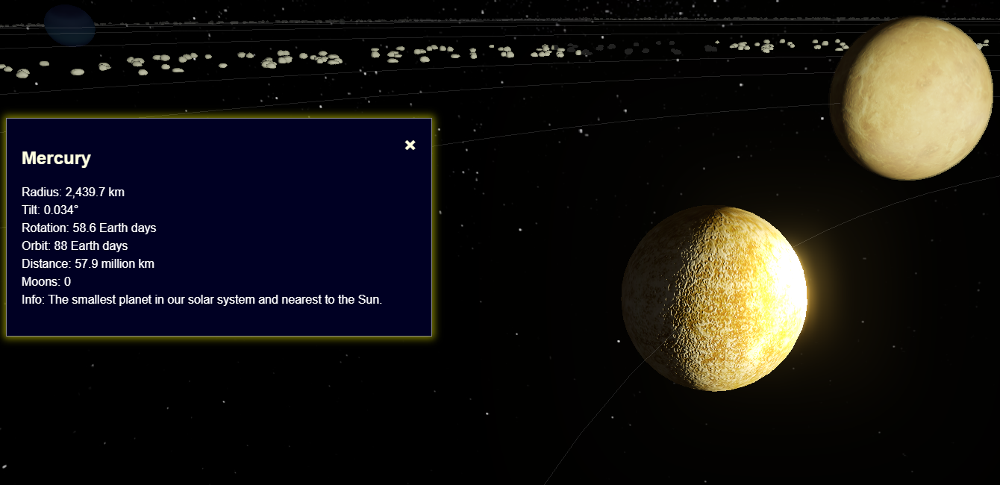
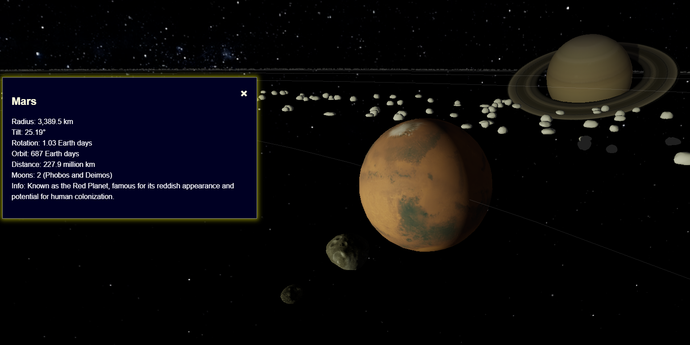

# 3D Solar System in THREE.js

Welcome to the **3D Solar System** project, a dynamic and interactive simulation of our solar system created using THREE.js and the Vite framework. This project showcases various advanced features and effects to provide an immersive experience of the celestial bodies in our solar system. The project is fully created by Karol Fryc.

Overview available at: https://w21030911.nuwebspace.co.uk/graphics/assessment/









## Features

### Standard Setup
- **Scene, Camera, Renderer**: Basic setup for rendering 3D scenes using THREE.js.
- **Controls**: Interactive controls for navigating the 3D space.
- **Texture Loaders**: Efficient loading of textures for planets, moons, and other objects.

### Postprocessing Effects
- **BloomPass**: Adds a glowing effect to the Sun.
- **OutlinePass**: Highlights planets with a white outline when hovered over.
- **EffectComposer**: Manages and combines all postprocessing effects for rendering.

### Star Background
- A realistic starry sky that provides a beautiful backdrop for the solar system.

### Interactive Controls
- **dat.GUI**: Allows users to adjust parameters such as orbit speed and the intensity of the Sun's glow.

### Lighting
- **AmbientLight**: Provides soft lighting throughout the scene.
- **PointLight**: Positioned at the center of the Sun to cast realistic shadows.

### Detailed Planet Creation
- **Attributes**: Size, position, tilt, texture, bump material, rings, and atmospheres.
- **Moons**: Includes moons with realistic textures and orbits.
- **Special Materials**: Earth’s ShaderMaterial for day/night transitions and moving clouds.
- **Non-Spherical Moons**: Phobos and Deimos are modeled from 3D objects for realism.

### Realistic Orbits and Rotations
- Planets and moons orbit the Sun and rotate on their axes with scaled distances and speeds.
- Scaled sizes for better visual representation: Mercury, Venus, Earth, Mars, and Pluto are at actual scale, while larger planets are scaled down for balance.

### Shadows
- Realistic shadow casting from the PointLight at the Sun’s center.

### Asteroid Belts
- **Procedurally Generated**: 1000 asteroids for the belt between Mars and Jupiter, 3000 for the Kuiper belt.
- **Performance Optimization**: Simplified textures to ensure high performance.

### Select Feature
- **Hover Effect**: White outline around planets when hovered.
- **Zoom In**: Camera zooms in and displays planet details on click.
- **Zoom Out**: Returns to default view on closing the pop-up.

## Resources
3D objects and textures were sourced from the following free repositories:
- [NASA 3D Resources](https://nasa3d.arc.nasa.gov/images)
- [Solar System Scope Textures](https://www.solarsystemscope.com/textures/)
- [Planet Pixel Emporium](https://planetpixelemporium.com/index.php)
- [TurboSquid](https://www.turbosquid.com/)

## Installation and Setup
1. Clone the repository:
    ```sh
    git clone https://github.com/your-username/3d-solar-system.git
    ```
2. Navigate to the project directory:
    ```sh
    cd 3d-solar-system
    ```
3. Install dependencies:
    ```sh
    npm install
    ```
4. Start the development server:
    ```sh
    npm run dev
    ```
5. Open your browser and navigate to `http://localhost:3000` to see the 3D Solar System in action.

## Conclusion
This project is a comprehensive representation of our solar system, bringing together realistic modeling, advanced visual effects, and interactive features. Explore the planets, their moons, and the vast asteroid belts, all from the comfort of your screen.

Feel free to contribute, suggest improvements, or use this project as a foundation for your own THREE.js experiments. Happy exploring!
